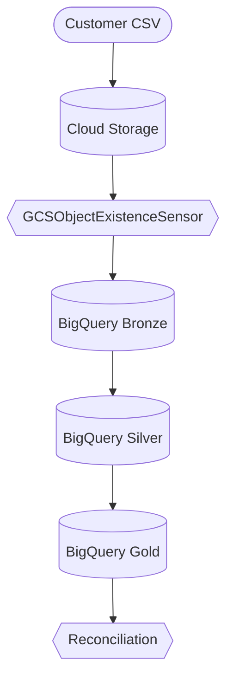
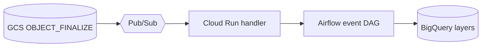

# CloudPulse Architecture

The root README contains the full colored Mermaid architecture diagrams and embedded execution evidence.

## Main sensor-based flow

```mermaid
flowchart TB
  CSV([Customer CSV]) --> GCS[(Cloud Storage)] --> SENSOR{{GCSObjectExistenceSensor}}
  SENSOR --> BRONZE[(BigQuery Bronze)] --> SILVER[(BigQuery Silver)] --> GOLD[(BigQuery Gold)] --> QA{{Reconciliation}}
```

## Event-driven extension

```mermaid
flowchart LR
  GCS[(GCS OBJECT_FINALIZE)] --> PS{{Pub/Sub}} --> CR[Cloud Run handler] --> DAG[Airflow event DAG] --> BQ[(BigQuery layers)]
```
